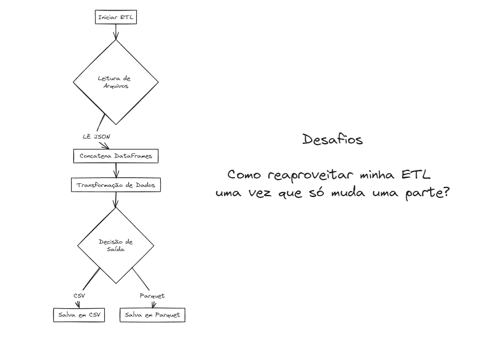

# aula08_bootcamp

# Imagem do Projeto

"""
Estrutura do Projeto:

- Ferramenta de Processameno = Pandas
- Ferramenta de Qualidade =

1. Modulo de Etl: Criar um arquivo etl.py:
    - Ler um arquivo
    - Extract
    - Concatenar os arquivos
    - Transformar os arquivos
    - Load dos meus arquivos (posso decidir por 2 caminhso)

2. Modulo de Pipeline: Criar arquivo pipeline.py:
    - Vai chamar a pipeline

3. Modulo de Schema: Criar arquivo schema.py:
    - Validação do dataframe

"""
